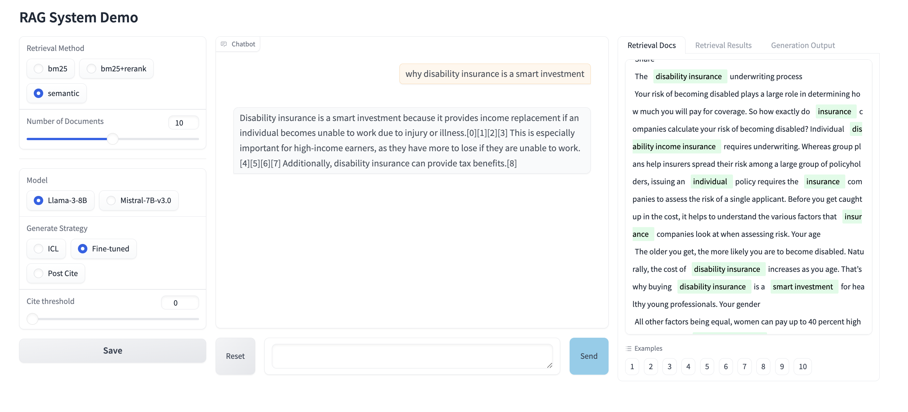

# Attributable RAG System 
***

## Overview
This repository contains the source code for an end-to-end Attributable RAG system, providing verifiable citations in response to user queries.

**Components**:
- **Indexer**: Stores and manages the knowledge corpus
- **Retriever**: Implementations of sparse and dense retrieval, along with query optimization techniques such as query rewriting and query decomposing
- **Generator**: Training and Inferencing code for LLM-based generator capable of generating responses with in-line citations.

## Demo

To run a Gradio web UI demo on a local device, follow the command below:

`python -m app.app --host 0.0.0.0 --port 7860`

The demo interface will allow the user to select the model and customize the retriever settings. Additionally, information related to the documents cited in the response will be highlighted, making it easier verification.

